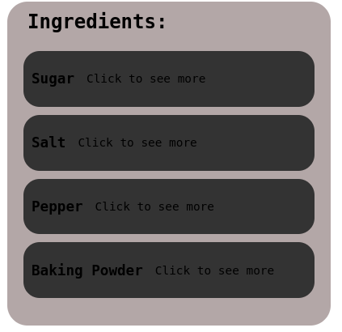

# ReactWorkshop

Welcome to our React workshop. If you have already worked with React, you certainly have used library before.
The goal of this workshop is to create a short npm package, or library.

This library will export 2 components that you will build during this workshop.
Because the goal of this workshop is not to learn React, we will help you on the basic 

# Requirements

Before starting the workshop, you will need to install a few things.

### Install Node:

```shell
sudo dnf install nodejs
```

### Install Node Package Manager:

```shell
sudo dnf install npm
```

### Create an account on npm:

Go to [npm main page](https://www.npmjs.com/) and create an account.

Run this command and follow the instructions:

```shell
npm login
```

## Step 0

To start the workshop, create an empty directory called <name>-test-react-lib.
<name> being your name.
Now run the command:

```shell
npx create-react-app ./<name>-test-react-lib
```

In order for the command to work, the directory name must not contains any uppercase letter.

After that,
```shell
cd ./<name>-test-react-lib
```

In the `src` folder, remove all the files except App.js, index.css, index.js.
Create a new directory called `lib`.

It should look like this:


Remove all the unused lines in index.js and App.js.
Run `npm start`, it should open a new page on your browser.
What you will see is the app you currently have.
In the lib folder, create a `index.js` file, as well as a folder called `components`.
In the `components` folder, create two folders called `IngredientList` and `MenuList`, they will be the two components we will export at the end of the workshop.
Copy the `data.js` file of the `utils` repository in your `src` folder.

Your `src` folder should look like this:


## Step 1

In the `IngredientList` folder, create an `IngredientList.js` file.

In the `.js` file, create a basic component and export it in the `index.js` in the `component` folder.

Here is a simple example of a component in react:

Of course, name it after the file your are in.

Copy the `IngredientList.css` file from the `utils` folder of the repository and paste it in the folder.
Now modify your component in order for it to take a list called `data` as parameter.
In your component, map over the data object to get a list of the ingredients you can have.

At the end, it should look like this:


## Step 2

In the `MenuList` folder, create an `MenuList.js` file.

In the `.js` file, create a basic component and export it in the `index.js` in the `component` folder.

Copy the `MenuList.css` file from the `utils` folder of the repository and paste it in the folder.
Now modify your component in order for it to take a list called `data` as parameter.
In your component, map over the data object to get a list of the menus you can have.

## Before going further

In your `App.js` file, import your to new components in order to use them. In order for it to work, you need to import the `Ingredients` and the `Menus` lists from from `data.js` given above.

In the main div of your App component, call both of your components passing the lists as parameters.

Refresh your web page to see your updated app!

## The library

To be able to create your library, run the following commands:

```shell
npm install --save-dev @babel/core @babel/cli @babel/preset-env

npm install -save @babel/polyfill
```

In your source folder, create a `babel.config.json` and copy these lines:

```json
{
 "presets": [
  [
   "@babel/env",
    {
     "targets": {
     "edge": "17",
     "firefox": "60",
     "chrome": "67",
     "safari": "11.1"
      },
   "useBuiltIns": "usage",
   "corejs": "3.6.5"
    }
],
   "@babel/preset-react"
]
}
```

In `package.json`, under scripts, replace the build script with the following:

```json
"build": "rm -rf dist && NODE_ENV=production babel src/lib --out-dir dist --copy-files";
```

Now run this command, it will generate a `dist` folder containing your future library:

```shell
npm run build
```

Now you will need to modify the `package.json` in order to publish your library.
Modify it with your own modifications. Here is an example of mine:

```json
"name": "react-workshop-epitech",
"description": "Two test React components",
"author": "bigpocc",
"keywords": ["react", "components", "ui", "epitech", "workshop"],
"version": "0.1.0",
"private": false,
"main": "dist/index.js",
"module": "dist/index.js",
"files": [ "dist", "README.md" ],
"repository": {
    "type": "git",
    "url": "git+https://github.com/TitouanChesneau/ReactWorkshop.git"
},
```

You can finally run

```shell
npm publish
```

If you followed the instructions I gave you, in any other React application, you will be able to run the command bellow and access your two components everywhere.

```shell
npm install the-name-of-your-library
```

## Bonus

If you finished all the steps above, you can try to make a nice and usefull library than you will be able to use in all your future projects. Think of adding usefull components like custom buttons, tooltips and more...

### Thank you for your participation to this workshop !